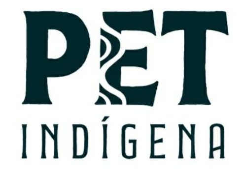

  

# Portal PET-Indígena UFPB (Campus IV)

*O Acesso e Permanência do Universitário Indígena na Academia*

Plataforma digital dedicada à visibilidade, memória e divulgação das ações do Programa de Educação Tutorial PET-Indígena (CCAE/UFPB).

## Funcionalidades

- **Ações e Projetos:** Vitrine das atividades de extensão, eventos científicos e publicações do grupo.
  
- **Mural de Relatos:** Espaço dedicado a depoimentos, vivências e a trajetória dos estudantes indígenas na academia.
  
- **Espaço do Integrante:** Apresentação da comissão tutorial, bolsistas e voluntários.

- **Guia do Processo Seletivo:** Centralizador de informações de editais, checklists de documentação exigida e cronogramas interativos.

## Tecnologias Utilizadas
